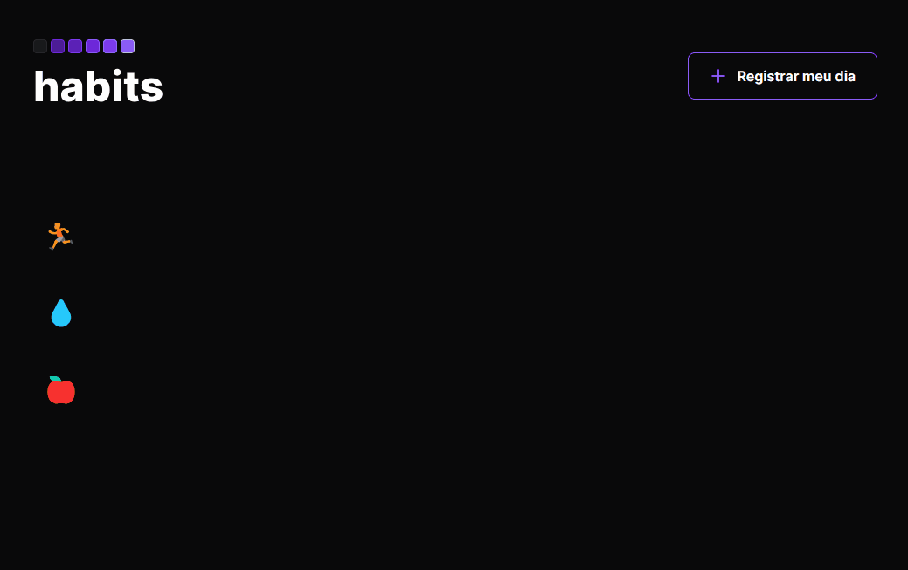

<div align="center">
  <h1>habits</h1>
  <p>Aplicação que registra o dia e o hábito(s) predefinidos que o usuário adicionar de forma simples, por meio de um check e uncheck, utilizado o local storage para salvar os dados.</p>
  
</div>

# 📒 Índice
* [Descrição](#descrição)
* [Requisitos Funcionais](#requisitos)
* [Tecnologias](#tecnologias)
* [Design](#design)
  * [Cores](#cores)
  * [Fontes](#fontes)
* [Instalação](#instalação)
* [Licença](#licença)

# 📃 <span id="descrição">Descrição</span>
Aplicação que registra o dia e o hábito(s) predefinidos que o usuário adicionar de forma simples, por meio de um check e uncheck, utilizado o local storage para salvar os dados e o notificações personalizadas com a lib [**ALERTIFY JS**](https://alertifyjs.com/).

# 📌 <span id="requisitos">Requisitos Funcionais</span>
- [x] Registro de dias<br>
- [x] Permitir realizar um check de um habito e um uncheck<br>
- [x] Visualização de dias e os hábitos registrados e nao registrados<br>

# 💻 <span id="tecnologias">Tecnologias</span>
- **HTML**
- **CSS**
- **JavaScript**
- **ALERTIFY JS**

# 🎨 <span id="design">Design</span>
- O modelo final para versão desktop e mobile está disponível na pasta `./design`

- <span id="cores">Cores<br></span>
  * #09090a<br>
  * white<br>
  * #8b5cf6<br>
  * #18181b<br>
  * #a1a1aa<br>
  * #27227a<br>
  * #a78bfa<br>

- <span id="fontes">Fontes<br></span>
  * Inter, Roboto Mono, monospace

# 🚀 <span id="instalação">Instalação</span>
```bash
  # Clone este repositório:
  $ git clone https://github.com/CleilsonAndrade/habits.git
  $ cd ./habits
```

# 📝 <span id="licença">Licença</span>
Esse projeto está sob a licença MIT. Veja o arquivo [LICENSE](LICENSE) para mais detalhes.

---

<p align="center">
  Feito com 💜 by CleilsonAndrade
</p>